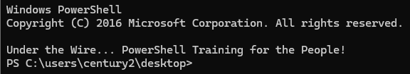

# Century 1

> 
> 
> 
> **Challenge Prompt**
> 
> Level 1 • Century
> 
> ```
> The password for Century2 is the build version of the instance of PowerShell installed on this system.
> ```
> 

## Solution of Century 1

### Step 1:

- using command `$PSVersionTable`

```jsx
PS C:\users\century1\desktop> $PSVersionTable

Name                           Value
----                           -----
PSVersion                      5.1.14393.9140
PSEdition                      Desktop
PSCompatibleVersions           {1.0, 2.0, 3.0, 4.0...}
BuildVersion                   **10.0.14393.9140**
CLRVersion                     4.0.30319.42000
WSManStackVersion              3.0
PSRemotingProtocolVersion      2.3
SerializationVersion           1.1.0.1
```

### Result:



> 
> 
> 
> Under the Wire... PowerShell Training for the People!
> PS C:\users\century2\desktop>
> 
