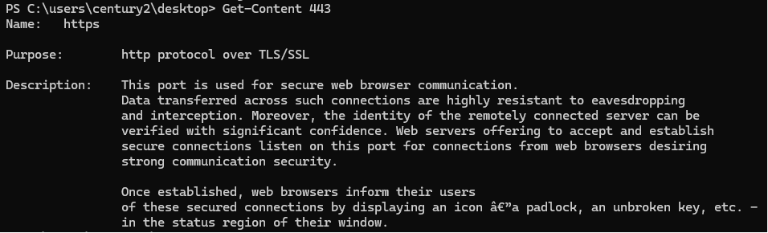
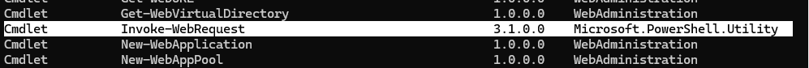

# Century 02

> 
> 
> 
> **Challenge Prompt**
> 
> Level 2 • Century
> 
> ```
> The password for Century3 is the name of the built-in cmdlet that performs the wget like function within PowerShell PLUS the name of the file on the desktop.
> ```
> 

---

# Solution of Century 02

### Step 1:

- using command `ls`

```jsx
Mode                LastWriteTime         Length Name
----                -------------         ------ ----
-a----        8/30/2018   3:29 AM            693 443

```

*now we need to understand how mode works.

| Mode | Type | Archive (`a`) | Read-only (`r`) | Hidden (`h`) | System (`s`) | Reparse Point (`l`) | Description |
| --- | --- | --- | --- | --- | --- | --- | --- |
| `-a----` | File | ✓ | ✗ | ✗ | ✗ | ✗ | Normal file with the Archive attribute set. |
| `d-----` | Directory | ✗ | ✗ | ✗ | ✗ | ✗ | Standard folder with no special attributes. |
| `-ar---` | File | ✓ | ✓ | ✗ | ✗ | ✗ | Read-only file; can be opened but not modified without changing the attribute. |
| `-a-h--` | File | ✓ | ✗ | ✓ | ✗ | ✗ | Hidden file; not shown in File Explorer unless hidden items are enabled. |
| `-a-hs-` | File | ✓ | ✗ | ✓ | ✓ | ✗ | Hidden system file; commonly used for Windows operating system files. |
| `d-r---` | Directory | ✗ | ✓ | ✗ | ✗ | ✗ | Read-only directory; often seen on special Windows folders. |
| `d----l` | Directory | ✗ | ✗ | ✗ | ✗ | ✓ | Directory that is a symbolic link or junction (reparse point). |
| `-a---l` | File | ✓ | ✗ | ✗ | ✗ | ✓ | Symbolic link to another file. |

```jsx
How to understand:
http://xahlee.info/powershell/powershell_get_content.html
```

### Step 2:

- using command `Get-Content 443` to view the content of the file.



### Step 3:

- using command `Get-Command web` to view the content of the file.

> 
> 
> 
> I did not know the exact name of the cmdlet, so I used `Get-Command` to search for available PowerShell commands. 
> 
> The wildcard `*web*` searches for any command whose name contains the word **"web"**, since `wget` is a tool used for downloading content from the web.
> 



- Among the results, `Invoke-WebRequest` is the built-in PowerShell cmdlet that performs functionality similar to Linux's `wget`.

### Result:

- using command `invoke-webrequest443`

> 
> 
> 
> Windows PowerShell
> Copyright (C) 2016 Microsoft Corporation. All rights reserved.
> 
> Under the Wire... PowerShell Training for the People!
> PS C:\users\century3\desktop>
> 

